django-project
===============
Django를 이용한 주식정보 제공 서비스
----------------------------------

## 1. 개발환경
### 1) Back-end
* Python Ver. 3.6.4
* Django Ver. 2.0.7
* MySQL Ver. 14.14 Distrib. 5.7.22,
### 2) 오픈 라이브러리
* W3.CSS
* jQuery Ver. 3.3.1
* Google Chart
* konlpy Ver. 0.4.4
* jQuery-File-Upload
## 2. 목적
* 주가의 변화와 관련 뉴스를 한 페이지에서 볼 수 있는 서비스 제공
  * 각 뉴스의 주요 키워드 추출하여 제공
  * 날짜 - 주식가격 차트 제공
  * 선택 날짜와 주식종목에 해당하는 뉴스기사 링크  
* 커뮤니티를 제공하고 사용자의 관심 주식 및 이슈 분석 (미구현)
* 뉴스 및 커뮤니티 내 키워드를 분석하여 주가 예측 (미구현)
## 3. 페이지 상세설명
### 메인페이지
* 코드 링크
  * [views](https://github.com/ssook7979/django-project/blob/master/mysite/board/views.py#L35) 
  * [HTML](https://github.com/ssook7979/django-project/blob/master/mysite/board/templates/board/index.html)

### 로그인
* 코드 링크
  * [views](https://github.com/ssook7979/django-project/blob/master/mysite/members/views.py#L64) 
  * [models](https://github.com/ssook7979/django-project/blob/master/mysite/members/models.py)
  * [JavaScript](https://github.com/ssook7979/django-project/blob/master/static/members/js/login.js)
  * [HTML](https://github.com/ssook7979/django-project/blob/master/mysite/members/templates/members/login.html)
  * [forms](https://github.com/ssook7979/django-project/blob/master/mysite/members/forms.py#L75)
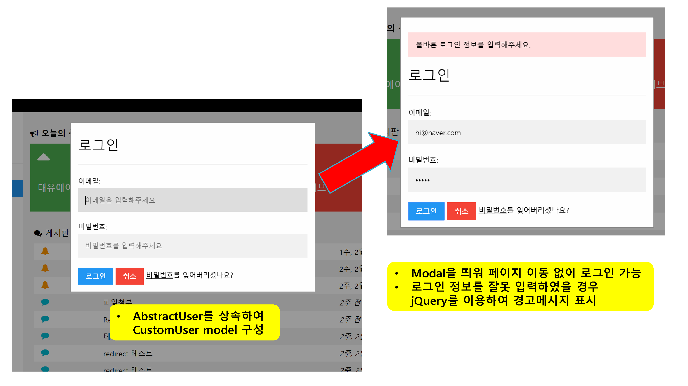
### 비밀번호 재설정
* 코드 링크
  * [HTML](https://github.com/ssook7979/django-project/blob/master/mysite/templates/registration/password_reset_form.html)

### 비밀번호/닉네임 변경
* 코드 링크 (비밀번호 변경)
  * [views](https://github.com/ssook7979/django-project/blob/master/mysite/members/views.py#L48) 
  * [HTML](https://github.com/ssook7979/django-project/blob/master/mysite/members/templates/members/password_change.html)
  * [forms](https://github.com/ssook7979/django-project/blob/master/mysite/members/forms.py#L32)
* 코드 링크 (닉네임 변경)
  * [views](https://github.com/ssook7979/django-project/blob/master/mysite/members/views.py#L32) 
  * [HTML](https://github.com/ssook7979/django-project/blob/master/mysite/members/templates/members/user_change.html)
  * [forms](https://github.com/ssook7979/django-project/blob/master/mysite/members/forms.py#L91)
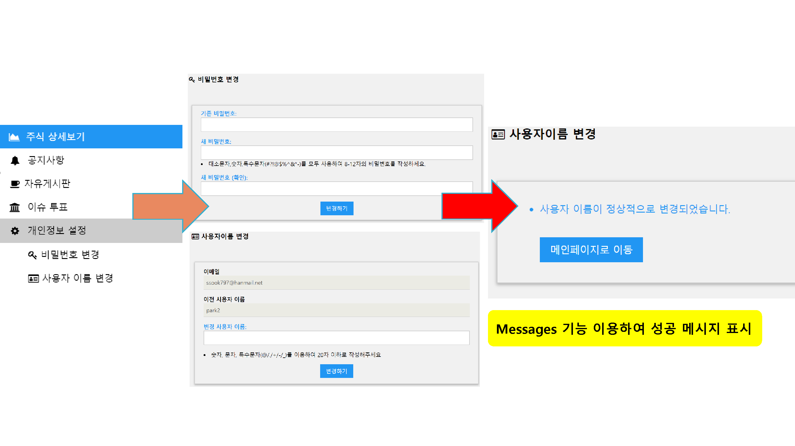
### 회원가입
* 코드 링크
  * [views](https://github.com/ssook7979/django-project/blob/master/mysite/members/views.py#L116) 
  * [models](https://github.com/ssook7979/django-project/blob/master/mysite/members/models.py)
  * [JavaScript](https://github.com/ssook7979/django-project/blob/master/static/members/js/signup.js)
  * [HTML](https://github.com/ssook7979/django-project/blob/master/mysite/members/templates/members/signup.html)
  * [forms](https://github.com/ssook7979/django-project/blob/master/mysite/members/forms.py#L42)
  * [validators](https://github.com/ssook7979/django-project/blob/master/mysite/members/validators.py)
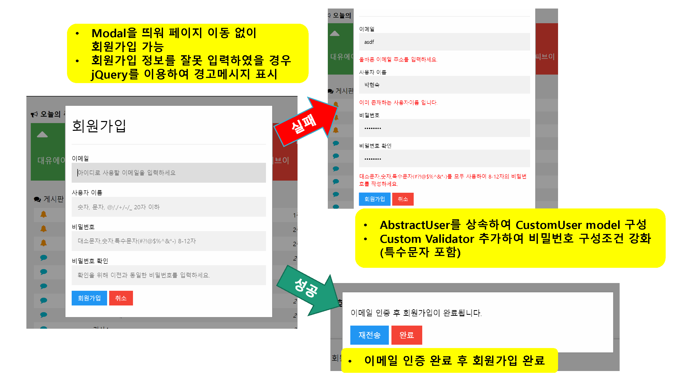
### 주식정보 화면
* 코드 링크
  * [views](https://github.com/ssook7979/django-project/blob/master/mysite/board/views.py#L53) 
  * [models](https://github.com/ssook7979/django-project/blob/master/mysite/board/models.py)
  * [JavaScript](https://github.com/ssook7979/django-project/blob/master/static/board/js/chart.js)
  * [HTML 차트](https://github.com/ssook7979/django-project/blob/master/mysite/board/templates/board/chart1.html)
  * [HTML 뉴스](https://github.com/ssook7979/django-project/blob/master/mysite/board/templates/board/article_html.html)
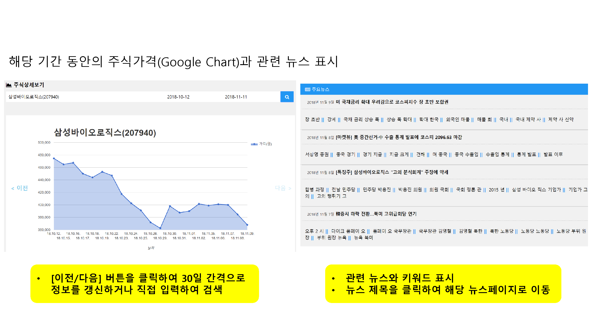
### 게시판 - 목록
* 코드 링크
  * [views](https://github.com/ssook7979/django-project/blob/master/mysite/board2/views.py#L26) 
  * [models](https://github.com/ssook7979/django-project/blob/master/mysite/board2/models.py)
  * [JavaScript(댓글창열기)](https://github.com/ssook7979/django-project/blob/master/static/board2/js/index.js)
  * [HTML](https://github.com/ssook7979/django-project/blob/master/mysite/board2/templates/board2/index.html)
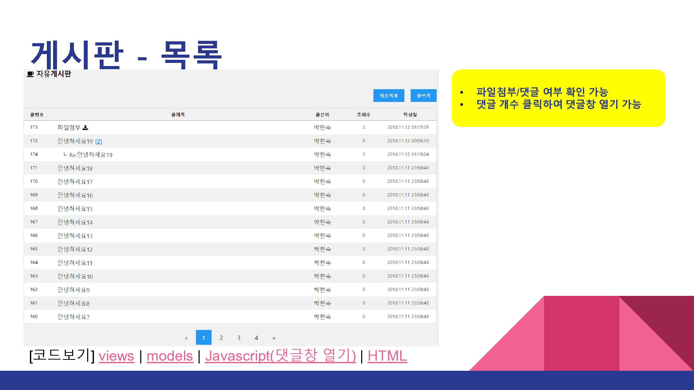
### 게시판 - 글읽기/댓글
* 코드 링크
  * [views](https://github.com/ssook7979/django-project/blob/master/mysite/board2/views.py#L59) 
  * [JavaScript](https://github.com/ssook7979/django-project/blob/master/static/board2/js/read.js)
  * [HTML](https://github.com/ssook7979/django-project/blob/master/mysite/board2/templates/board2/read.html)
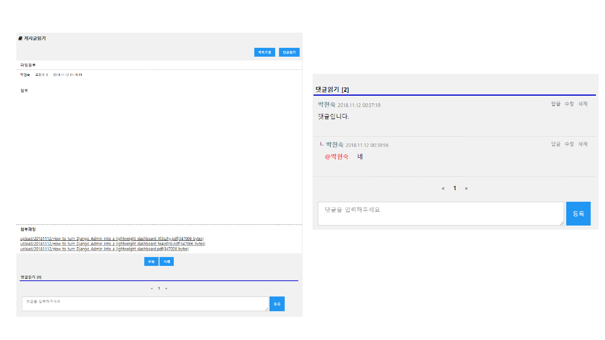
### 게시판 - 글쓰기
* 코드 링크(글쓰기)
  * [views](https://github.com/ssook7979/django-project/blob/master/mysite/board2/views.py#L91) 
  * [forms](https://github.com/ssook7979/django-project/blob/master/mysite/board2/forms.py#L15)
  * [JavaScript](https://github.com/ssook7979/django-project/blob/master/static/board2/js/write.js)
  * [HTML](https://github.com/ssook7979/django-project/blob/master/mysite/board2/templates/board2/write.html)
* 코드 링크(파일첨부)
  * [views](https://github.com/ssook7979/django-project/blob/master/mysite/file/views.py) 
  * [models](https://github.com/ssook7979/django-project/blob/master/mysite/file/models.py)
  * [HTML](https://github.com/ssook7979/django-project/blob/master/mysite/file/templates/file/upload.html)
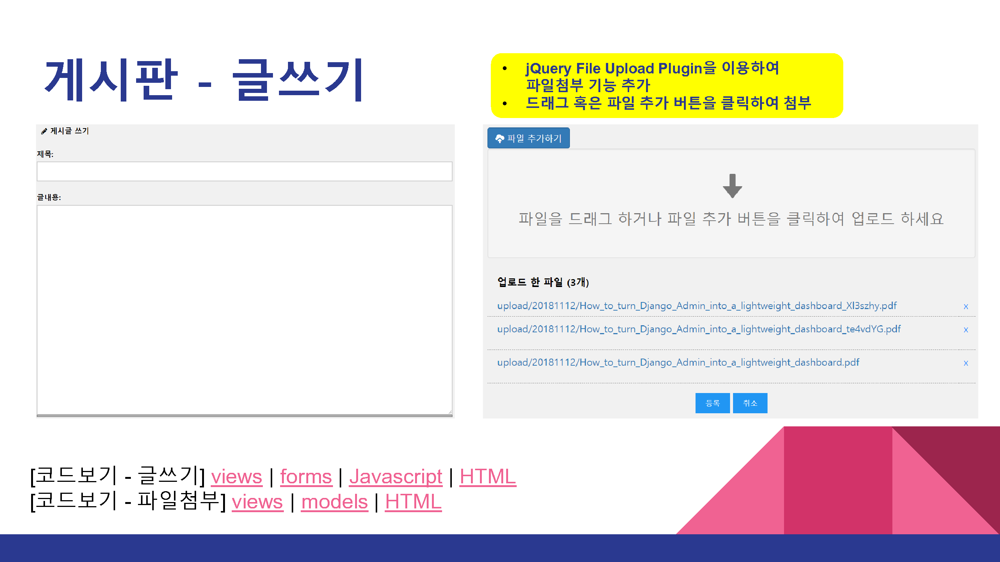
### 관리자 페이지 – 주식가격 업데이트
* 코드 링크
  * [admin](https://github.com/ssook7979/django-project/blob/master/mysite/board/admin.py#L12) 
  * [crawler](https://github.com/ssook7979/django-project/blob/master/mysite/board/crawler.py#L86)
  * [HTML](https://github.com/ssook7979/django-project/blob/master/mysite/board/templates/admin/board/stock/change_list.html)
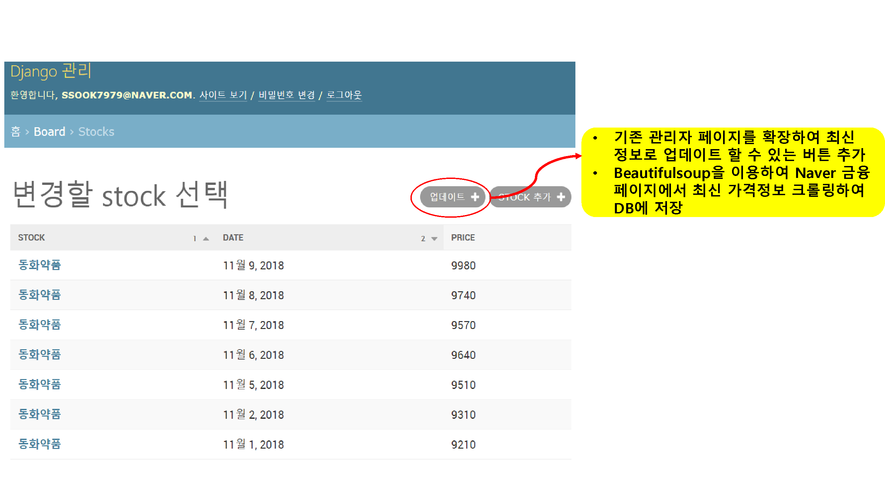
### 관리자 페이지 – 뉴스 업데이트
* 코드 링크
  * [admin](https://github.com/ssook7979/django-project/blob/master/mysite/board/admin.py#L29) 
  * [crawler](https://github.com/ssook7979/django-project/blob/master/mysite/board/crawler.py#L136)
  * [keyword 관련함수](https://github.com/ssook7979/django-project/blob/master/mysite/board/crawler.py#L18)
  * [HTML](https://github.com/ssook7979/django-project/blob/master/mysite/board/templates/admin/board/article/change_list.html)
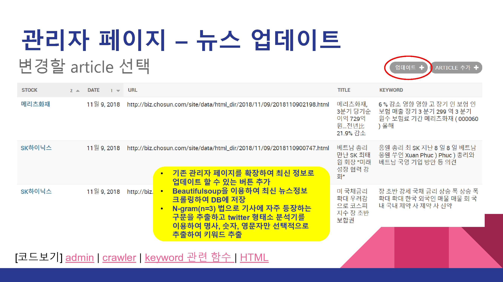
### 키워드 추출 방법
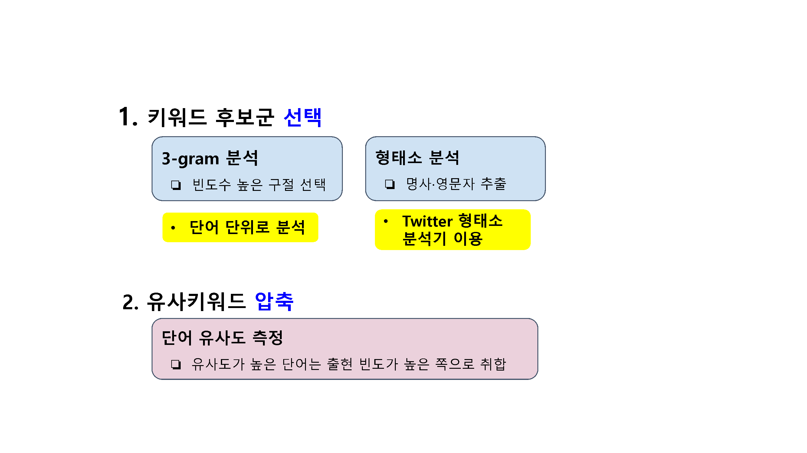
<pre><code>
def check_word_similarity(s1,s2):
    s1w = re.findall('[ㄱ-ㅎ|가-힣|a-z|A-Z|0-9|W*]', s1.lower())
    s2w = re.findall('[ㄱ-ㅎ|가-힣|a-z|A-Z|0-9|W*]', s2.lower())
                     
    s1cnt = Counter(s1w)
    s2cnt = Counter(s2w)
    
    common = set(s1w).intersection(s2w)
    
    common_ratio = difflib.SequenceMatcher(None, s1w, s2w).ratio()
    return common_ratio
            
def counter_reduce(counter, un_word=['$^$%']):
    new_counter = {}
    examined = []
    word_list = list(counter.keys())
    for idx, word1 in enumerate(word_list):
        for word2 in word_list[idx+1:]:
            if check_word_similarity(word1, word2) > 0.65 and word1 not in examined and word2 not in examined:
                if counter.get(word1,0) > counter.get(word2,0):
                    counter[word1] = counter[word1] + counter[word2]
                else:
                    counter[word2] = counter[word1] + counter[word2]
                del counter[word1]
                del counter[word2]
                examined.extend([word1,word2])
                break
    result = {**new_counter, **counter}
    return result
</code></pre>
### 비슷한 단어 합치기(counter_reduce) 예시

### 키워드 추출 예시
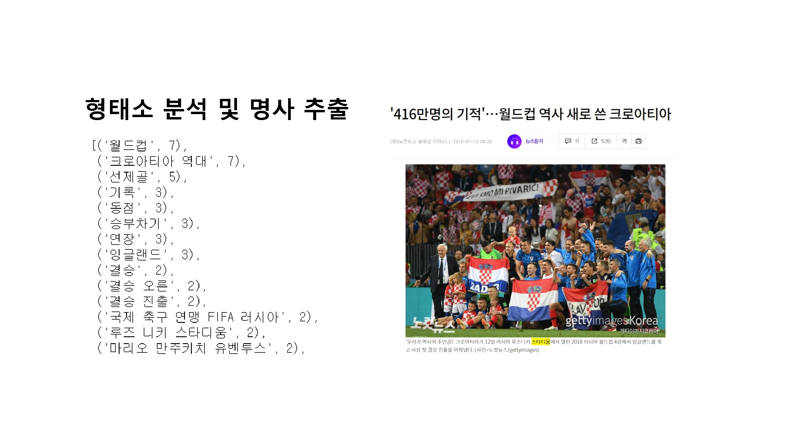
